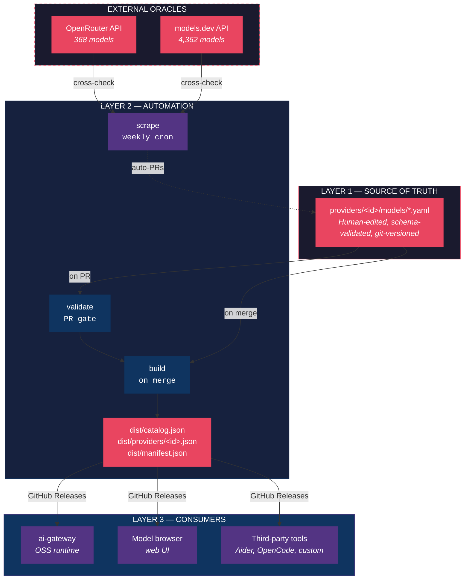
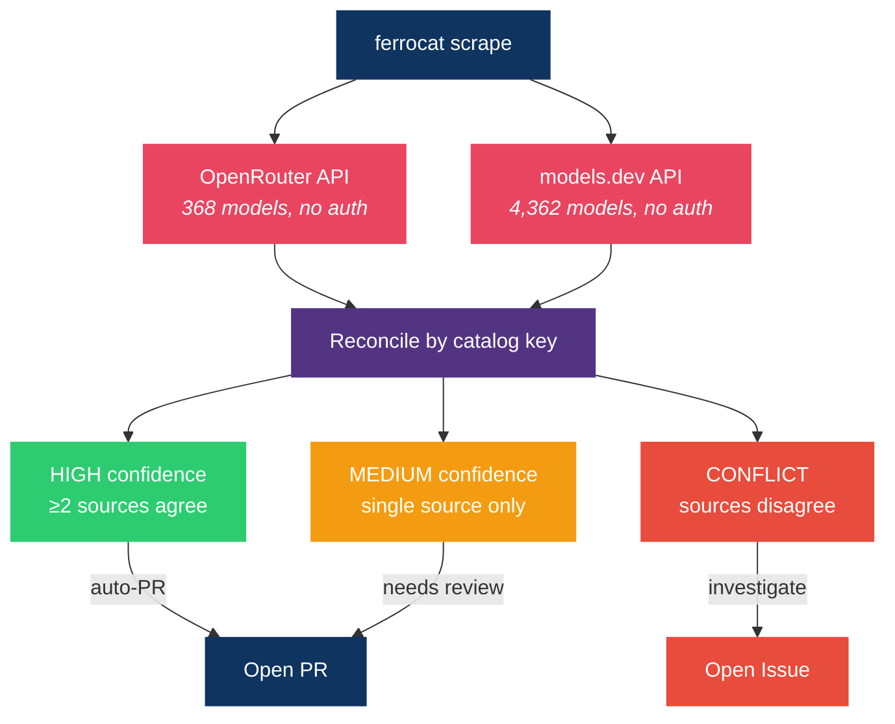

# Architecture

## Overview

The model catalog is a three-layer system: YAML source files → Go build pipeline → JSON distribution artifacts.



---

## Repo Structure

```
model-catalog/
├── cmd/
│   └── ferrocat/
│       └── main.go                 # CLI entry point
│
├── catalog/                        # Public Go library
│   ├── types.go                    # Entry, NullFloat64, Pricing, Capabilities, Lifecycle
│   ├── json.go                     # ReadCatalogJSON, WriteCatalogJSON
│   ├── yaml.go                     # ReadModelYAML, WriteModelYAML
│   ├── extends.go                  # ResolveExtends (deep-merge inheritance)
│   ├── build.go                    # Build() — YAML → JSON + slices + manifest
│   ├── split.go                    # Split() — JSON → per-model YAML
│   ├── validate.go                 # Validate() — structural correctness checks
│   ├── lint.go                     # Lint() — junk key detection + duplicates
│   ├── migrate.go                  # MigrateExtends() — convert wrappers
│   ├── manifest.go                 # Manifest, ManifestProvider, ManifestStats types
│   ├── yamlnode.go                 # YAML node helpers for wrapper generation
│   └── *_test.go
│
├── scrape/                         # Public Go library — scraper framework
│   ├── types.go                    # Observation, Confidence, Scraper interface
│   ├── httputil.go                 # FetchJSON() — shared HTTP client with retry
│   ├── reconciler.go              # Cross-check observations against catalog
│   ├── report.go                   # Human-readable scrape reports
│   └── oracle/
│       ├── openrouter.go           # OpenRouter /api/v1/models scraper
│       └── models_dev.go           # models.dev /api.json scraper
│
├── internal/
│   └── cli/                        # Cobra command wiring (thin wrappers)
│       ├── root.go                 # Root command
│       ├── build.go                # ferrocat build
│       ├── split.go                # ferrocat split
│       ├── validate.go             # ferrocat validate
│       ├── lint.go                 # ferrocat lint
│       ├── scrape.go               # ferrocat scrape
│       └── migrate.go              # ferrocat migrate-extends
│
├── providers/                      # Source of truth (2,468 YAML files)
│   ├── openai/models/              # 156 models
│   ├── anthropic/models/           # 25 models
│   ├── gemini/models/              # 78 models
│   ├── bedrock/models/             # 343 models
│   ├── azure/models/               # 115 models (mostly extends wrappers)
│   ├── vertex_ai/models/           # 123 models (mostly extends wrappers)
│   └── ...                         # 82 provider directories total
│
├── dist/                           # Generated artifacts (do not edit)
│   ├── catalog.json                # Full flat catalog
│   ├── manifest.json               # Version, SHA-256 hashes, stats
│   └── providers/                  # Per-provider JSON slices (82 files)
│
├── .github/
│   ├── workflows/
│   │   ├── validate.yml            # PR gate: validate + lint + test
│   │   └── build.yml               # On merge: build + CalVer tag + release
│   ├── CODEOWNERS
│   ├── ISSUE_TEMPLATE/
│   │   ├── new_model.md
│   │   ├── price_correction.md
│   │   └── new_provider.md
│   └── pull_request_template.md
│
├── docs/
│   └── architecture.md             # This file
├── Makefile
├── go.mod
├── CONTRIBUTING.md
├── README.md
└── LICENSE
```

---

## Data Model

### Model Entry (YAML → JSON)

Each model is a single YAML file at `providers/<provider>/models/<model-id>.yaml`:

```yaml
provider: openai                    # Must match folder name
model_id: gpt-4o                    # Provider's canonical model ID
display_name: GPT-4o
mode: chat                          # chat | embedding | image | audio_in | audio_out
context_window: 128000
max_output_tokens: 16384
pricing:
    input_per_m_tokens: 2.5         # USD per 1M tokens
    output_per_m_tokens: 10.0       # null = not applicable, 0 = free
    cache_read_per_m_tokens: 1.25
    cache_write_per_m_tokens: null
    reasoning_per_m_tokens: null
    image_per_tile: null
    audio_input_per_minute: null
    audio_output_per_character: null
    embedding_per_m_tokens: null
    finetune_train_per_m_tokens: null
    finetune_input_per_m_tokens: null
    finetune_output_per_m_tokens: null
capabilities:
    vision: true
    audio_input: false
    audio_output: false
    function_calling: true
    parallel_tool_calls: true
    json_mode: true
    response_schema: true
    prompt_caching: true
    reasoning: false
    streaming: true
    finetuneable: false
lifecycle:
    status: ga                      # preview | ga | deprecated | sunset | legacy
    deprecation_date: null
    sunset_date: null
    successor: null
source: https://openai.com/api/pricing
updated_at: "2026-04-30"
tier: flagship                      # flagship | standard
```

### Pricing conventions

- All prices in **USD per 1,000,000 tokens**
- `null` = field not applicable to this mode (e.g., embedding price on a chat model)
- `0` = genuinely free (e.g., self-hosted Ollama)
- `NullFloat64` custom Go type preserves `3.0` format in JSON (not `3`)

### Catalog key

The generated JSON uses `provider/model_id` as the map key:

```json
{
  "openai/gpt-4o": { ... },
  "anthropic/claude-sonnet-4-5": { ... }
}
```

### Filename sanitization

Model IDs containing `/` or `:` are sanitized for filenames:
- `/` → `__` (e.g., `meta-llama/Llama-3.1-70B` → `meta-llama__Llama-3.1-70B.yaml`)
- `:` → `_` (e.g., `anthropic.claude-v1:0` → `anthropic.claude-v1_0.yaml`)

---

## Extends Inheritance

When a provider hosts another provider's model (e.g., Vertex AI hosting Gemini, Azure hosting OpenAI), the wrapper uses `extends` to inherit from the base:

```yaml
# providers/vertex_ai/models/gemini-2.0-flash.yaml
extends: gemini/gemini-2.0-flash
provider: vertex_ai
model_id: gemini-2.0-flash
display_name: gemini-2.0-flash
pricing:
    input_per_m_tokens: 0.1         # override — different from base
    output_per_m_tokens: 0.4
    ...                             # all 12 pricing fields required
capabilities:
    vision: true
    ...                             # all 11 capability fields required
tier: standard
```

### Resolution rules

1. **Max chain depth = 1** — a wrapper cannot extend another wrapper
2. **Deep merge** — wrapper scalars win if non-empty, ints win if non-zero
3. **Pricing** — full replacement (wrapper must specify all 12 fields)
4. **Capabilities** — full replacement (bare bools can't distinguish "not set" from "false")
5. **Mode cannot be overridden** — a chat model can't become embedding via extends
6. **`extends` stripped from output** — consumers see a flat catalog, no inheritance metadata

### Current coverage

193 wrapper models across 4 providers:
- **azure** ← openai (87), anthropic (6), mistral (6), xai (6), deepseek (3), meta_llama (2), cohere (1), cerebras (1)
- **vertex_ai** ← gemini (48), anthropic (5), mistral (1)
- **github_copilot** ← openai (20), gemini (2)
- **azure_openai** ← openai (5)

---

## Build Pipeline

`ferrocat build` (or `make build`) does:

1. Walk `providers/*/models/*.yaml`
2. Read each YAML file into an `Entry`
3. Resolve `extends` inheritance (deep-merge wrappers onto bases)
4. Write `dist/catalog.json` — full flat map, sorted keys, 2-space indent
5. Group entries by provider → write `dist/providers/<id>.json` (82 slices)
6. Compute SHA-256 hashes → write `dist/manifest.json`

### Manifest

```json
{
  "version": "v2026.04.30",
  "schema_version": 1,
  "generated_at": "2026-04-30T12:00:00Z",
  "catalog_sha256": "af3860ac...",
  "providers": [
    { "id": "openai", "model_count": 156, "sha256": "1a2b3c..." }
  ],
  "stats": { "total_models": 2468, "total_providers": 82 }
}
```

### Versioning

- **CalVer**: `v2026.04.30`, with `.1` suffix for same-day releases
- Triggered on merge to `main` via `build.yml`
- Each release creates a GitHub Release with `catalog.json` and `manifest.json` attached

---

## Validation & Lint

### ferrocat validate

Structural correctness checks (CI gate — blocks merge on failure):

| Check | Rule |
|-------|------|
| Required fields | `provider`, `model_id`, `display_name`, `mode` must be non-empty |
| Provider match | `entry.Provider` must equal the containing folder name |
| Mode enum | `chat`, `embedding`, `image`, `audio_in`, `audio_out` |
| Status enum | `preview`, `ga`, `deprecated`, `sunset`, `legacy` |
| Tier enum | `flagship`, `standard` |
| Extends skip | `display_name` and `mode` not required for entries with `extends` |

### ferrocat lint

Data quality checks (warns but doesn't block):

| Check | Severity |
|-------|----------|
| Junk keys (dimension patterns, parameter segments) | Error |
| Duplicate model IDs across providers | Warning (extends candidates) |

---

## Scraper Architecture

Two oracle scrapers cross-check catalog pricing against external sources:



### Shared HTTP client

All scrapers use `scrape.FetchJSON()`:
- User-Agent: `ferro-labs-ai-catalog-scraper/1.0`
- Timeout: 30 seconds
- Retry: 3 attempts on 5xx with exponential backoff (2s, 4s)
- No retry on 4xx

### Confidence scoring

| Scenario | Confidence | Action |
|----------|-----------|--------|
| ≥2 sources agree on a value different from catalog | High | Auto-PR candidate |
| 1 source reports a diff | Medium | Needs manual review |
| Sources disagree with each other | Conflict | Open issue |

---

## CI/CD Workflows

### validate.yml (PR gate)

Triggers on PRs touching `providers/`, `overrides/`, `schema/`, `catalog/`, `scrape/`, `cmd/`, `internal/`.

Steps:
1. `ferrocat validate --strict`
2. `ferrocat lint`
3. `go test -race ./...`
4. `ferrocat build --output /tmp/dist` (dry-run)

### build.yml (release on merge)

Triggers on push to `main` or manual dispatch.

Steps:
1. Validate
2. Build (`dist/catalog.json` + slices + manifest)
3. Determine CalVer version (`v2026.04.30`)
4. Commit `dist/` with `[skip ci]`
5. Create git tag + GitHub Release with artifacts

---

## Go Package Design

### Public packages (importable by external consumers)

```
github.com/ferro-labs/model-catalog/catalog
github.com/ferro-labs/model-catalog/scrape
github.com/ferro-labs/model-catalog/scrape/oracle
```

`catalog/` is the primary consumer interface. `ai-gateway` imports it directly:

```go
import "github.com/ferro-labs/model-catalog/catalog"

data, _ := os.ReadFile("catalog.json")
entries, _ := catalog.ReadCatalogJSON(data)
model := entries["openai/gpt-4o"]
```

### Private packages

```
github.com/ferro-labs/model-catalog/internal/cli    # Cobra wiring, not importable
```

### Key types

| Type | Package | Purpose |
|------|---------|---------|
| `Entry` | `catalog` | Complete model metadata |
| `NullFloat64` | `catalog` | Nullable float that preserves `3.0` in JSON |
| `Pricing` | `catalog` | 12 pricing fields (NullFloat64) |
| `Capabilities` | `catalog` | 11 boolean capability flags |
| `Lifecycle` | `catalog` | Status, deprecation/sunset dates, successor |
| `Manifest` | `catalog` | Version, SHA-256, provider stats |
| `Observation` | `scrape` | Single data point from a scraper |
| `Delta` | `scrape` | Difference between catalog and scraped value |

---

## Distribution

### Artifacts

| File | Description | Cache |
|------|-------------|-------|
| `catalog.json` | Full flat catalog (all 2,468 models) | Mutable per release |
| `manifest.json` | Version, SHA-256 hashes, provider index | Mutable per release |
| `providers/<id>.json` | Per-provider slice (82 files) | Mutable per release |

All served via GitHub Releases (free, unlimited bandwidth for public repos).

### Consumer fetch pattern

```
1. Fetch manifest.json (~5 KB)
2. Check if catalog_sha256 changed since last fetch
3. If changed: fetch only the provider slices you need
4. Verify SHA-256 matches manifest
5. Swap in-memory catalog (atomic)
```

### Fallback chain

1. GitHub Releases (primary)
2. Embedded fallback in gateway binary (last resort)

---

## File Naming Conventions

### Provider IDs
- Lowercase, snake_case: `openai`, `vertex_ai`, `azure_foundry`
- Must match the value in `providers/names.go` in the gateway repo

### Model filenames
- Match canonical provider model ID with sanitization
- `/` → `__`, `:` → `_`
- Example: `meta-llama/Llama-3.1-70B` → `meta-llama__Llama-3.1-70B.yaml`

### Generated artifacts
- `dist/catalog.json` — full catalog
- `dist/manifest.json` — metadata pointer
- `dist/providers/<id>.json` — per-provider slices
